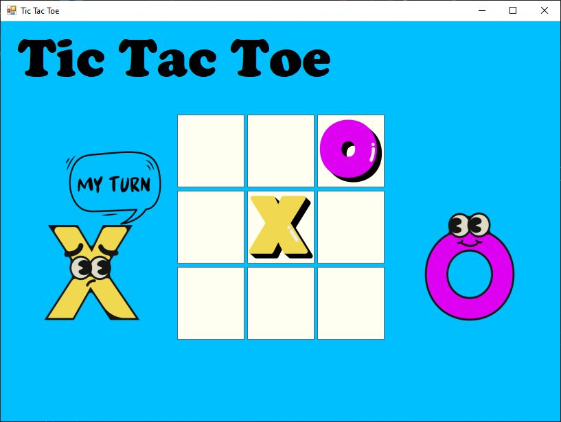
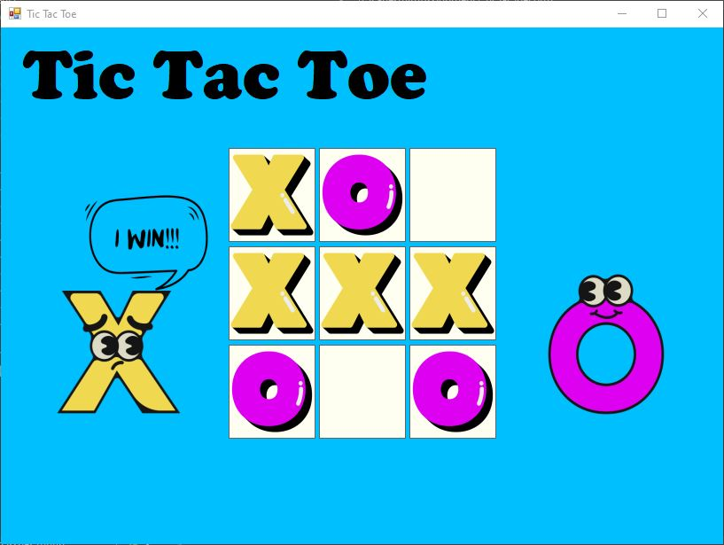

# Tic Tac Toe

## Table of Contents

- [Overview](#overview)
- [Built With](#built-with)
- [Contact](#contact)

## Overview

<!-- TODO: Add a screenshot of the live project.
    1. Link to a 'live demo.'
    2. Describe your overall experience in a couple of sentences.
    3. List a few specific technical things that you learned or improved on.
    4. Share any other tips or guidance for others attempting this or something similar.
 -->

 A fun game of tic tac toe playing around with timer events, 2D arrays, and checking win conditions. This was a simpler program to implement, allowing for more time to focus on the structure of the code and streamlining the conditionals used in the game logic.

### Built With :computer:

<!-- TODO: List any MAJOR libraries/frameworks (e.g. React, Tailwind) with links to their homepages. -->
C# using Windows Forms App (.NET Framework)

## Contact

<!-- TODO: Include icons and links to your RELEVANT, PROFESSIONAL 'DEV-ORIENTED' social media. LinkedIn and dev.to are minimum. -->

## Images from the project :camera_flash:

